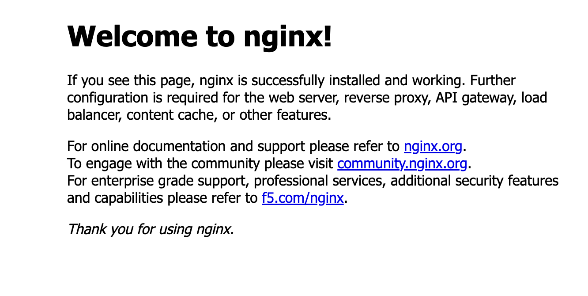

# Setup ECS Service with Task Definition in ECS Cluster - Fargate/EC2 On-Demand

The example demostrates how to use the shared modules to create an ECS service leveraging Fargate/EC2 On-Demand capacity provider.

The example uses the following shared modules:

| Shared Module       | Description                                       |
| ------------------- | ------------------------------------------------- |
| ecs_cluster         | Create ECS cluster with Fargate capacity provider |
| ecs_service         | Create ECS service with task definition           |
| ecs_task_definition | Create ECS task definition                        |
| ecs_iam_role        | Create ECS task execution IAM role                |
| ecs_alb             | Create ALB with target group, listener            |

## Network Resources

In order to create an ECS service, we need to setup a proper network configuration. The example uses the following network resource that already exists.

- Default VPC
- Default subnets - Public attached with Internet Gateway
- Default security group - Allow SSH, HTTP, HTTPS, and ICMP traffic
- Default route table - Route to Internet Gateway
- Custom subnets - Private attached with NAT Gateway
- Custom route table - Route to NAT Gateway

Besides, in `network.tf`, below resources are created to allow outbound traffic from the private subnets.

- NAT Gateway
- NAT IP
- A new route is added to the custom route table

## Provision Resources

In the `examples/ecs_app` directory, run the following `just` commands:

```bash
# plan and apply ecs service resources
just plan-apply

# output ALB endpoint, and open the endpoint in browser
just get-alb-endpoint

# [*]  Get ALB endpoint...
# http://nginx-alb-xxxxxxxx.<aws-region>.elb.amazonaws.com
```

A welcome page for NGINX service should be opened in the browser as follows. Now you have launched an Nginx service using ECS & ALB.



## Clean up Resources

```bash
just destroy-apply
```
